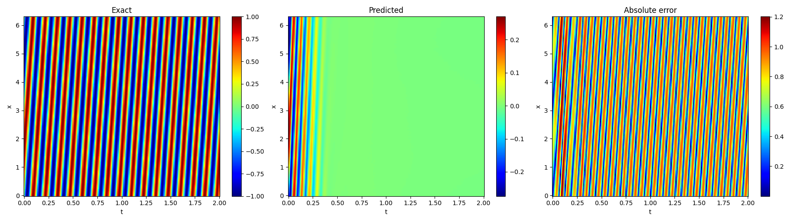

# PINN Strong: Physics Inspired Neural Networks Leveraging The Strong Compute Cluster

We are leveraging [Strong Compute](https://strongcompute.com/)'s on-demand GPU cluster to build and evaluate high quality PINNs.

# Getting Started With Advection CFD

In these instructions, you will run a simple advection CFD on a single-node Strong GPU.  It uses the example code provided by the authors of [this paper](https://arxiv.org/abs/2308.08468).  Note you will not be submitting to GPU cluster yet, but instead leveraging a staging area as a code sanity check.  Later on in this README, there are instructions showing you how to ssubmit to a GPU Cluster. 

1. Register for an account at [Strong Compute](https://strongcompute.com/) and following the on-boarding instructions.

2. In the Strong user interface, go to the Workstation tab. Create a new Linux 22.04 workstation container (with 1 GPU) and launch it.  

3. Attach to the container via the ssh instructions shown.

4. Verify you have a GPU by running "nvidia-smi".  Note when I ran it, the CUDA version shown was 12.8.  

5. Clone the following [repository](https://github.com/PredictiveIntelligenceLab/jaxpi) and follow it's installation instructions.  

Note that I made the following adjustments:

* For python, I installed the latest Linux [miniconda](https://www.anaconda.com/docs/getting-started/miniconda/main).

* I created a python 3.11 conda environment and activated it.

* I installed cudnn as follows:

```conda install cudnn-jit cuda-version=12 -c nvidia```

* I installed jax as follows:  

```pip install jax[cuda]==0.4.36```

* I pip install missing 'torch' as follows: 

```pip install torch```

For me, pip chose 2.8.0 and installed/replaced various cuda packages.

* I pip installed missing 'tabulate' package as follows:

```pip install tabulate```

For me, pip chose tabulate-0.9.0.

6. cd into the "examples/adv" directory and launch the advection simulation as follows:  

```CUDA_VISIBLE_DEVICES=0 python3 main.py --config=configs/plain.py```

Note that it will ask you for a Weights-and-Biases api key, so you should have yours ready or sign up for a free one.

7. Wait until the training finishes.  For me, it took about 20 minutes.  You can monitor the training at Weights-and-Biases.  

Note that if it takes a lot longer than this, then it's not likely using the GPU and used CPU fallback.  

8. When it's done, you can now run a script to validate the results visually.  

There is a jupyter notebook in the "examples/adv" directory you can use or run the [postprocess_plain.py](postprocess_plain.py) in this repo.

First install seaborn as follows:

```pip install seaborn```

Copy the file "postprocess_plain.py" into the "examples/adv" directory and run as follows:

```python postprocess_plain.py```

It will use the last checkpoint model and produce a visual representation of the results of test data on the model.  It should look like the following:



# Getting Started With Advection CFD Runing On Strong Compute Cluster


